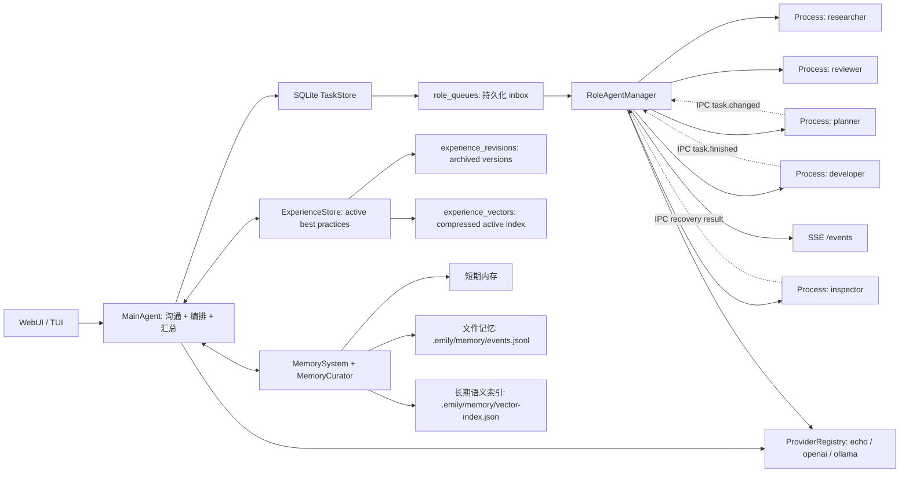

# emily-agent

一个 Node.js / TypeScript 多 agent 运行时骨架：主 agent 负责沟通、任务编排和恢复监督，subagent 作为独立进程执行具体工作。系统使用 SQLite 作为事实来源，IPC 只做实时通知；记忆系统采用原始记忆、长期索引和可更新经验三层结构。

> 当前 TypeScript 直接使用 Node 22 的原生 type stripping 运行，不引入构建链。SQLite 使用 `node:sqlite`，运行时会出现 experimental warning。

## 架构



## 已实现的 10 个可靠性优化

1. **严格 Task 状态机**
   状态流转集中在 `TaskStore.transitionTask()`，非法跳转会抛错。当前状态包括 `pending`、`queued`、`running`、`blocked`、`needs_inspection`、`done`、`failed`、`dead_letter`。

2. **lease token + heartbeat**
   worker 领取任务时写入 `lease_owner`、`lease_token`、`lease_expires_at`、`heartbeat_at`。后续 heartbeat / finish / fail / cancel 都必须带本次领取的 `lease_token`，避免旧 worker 的晚到写入覆盖重试后的新执行。

3. **崩溃窗口恢复**
   IPC 只发送 `taskId/eventId`。主进程收到通知后回 SQLite 查询最终状态。worker 异常退出、通知丢失、lease 过期都会进入恢复流程。

4. **持久化 role inbox**
   每个角色的任务队列存入 SQLite `role_queues` 表。主进程重启后可以继续 drain 队列，而不是依赖内存队列。

5. **结构化 `agent.md`**
   `agents/<role>/agent.md` 支持 frontmatter，定义 `role`、`provider`、`model`、`singleton`、`allowed_tools`、`forbidden_tools`、`max_concurrent_tasks` 和 `capabilities`。

6. **硬权限 ToolGateway**
   subagent 不直接假定自己能用工具，必须经过 `ToolGateway.assertAllowed()`。现在先接入权限校验骨架，后续真实文件、shell、浏览器工具都应从这里走。

7. **事件订阅**
   Web adapter 提供 `GET /events` SSE。TUI/WebUI 可以订阅 `task.changed`、`task.finished`、`agent.heartbeat` 等运行事件。

8. **Memory Curator**
   `MemoryCurator` 决定哪些记录进入长期语义索引。subagent 结果先进入 `memory_candidates`，由 main agent 或 maintenance 审批后才写入 MemorySystem，避免被拒绝的结果绕过审批直接污染长期记忆。

9. **retry / dead-letter**
   task 记录 `retry_count` 和 `max_retries`。超过重试上限会进入 `dead_letter`，并记录 `deadLetterReason`。

10. **TypeScript 迁移**
    源码和测试已迁移到 `.ts`，核心类型在 `src/types.ts`。

## 运行内核

每次用户请求都会创建一个 `run`，并把 task、event、memory candidate 和最终 response 串起来，便于复盘。

已实现的核心能力：

- `runs`: 一次用户请求的结构化运行记录。
- `runs.status`: 支持 `running`、`reviewing`、`recovering`、`partially_done`、`waiting_user`、`done`、`failed`、`blocked`、`cancelled`，用于区分执行、验收、恢复、等待用户输入和主动取消。
- `TaskResult`: worker 结果使用结构化 JSON，包含 `status`、`summary`、`artifacts`、`memoryCandidates` 和 `nextActions`。
- `task_graphs`: 为一次 run 的 DAG 提供 graph id，task metadata 会带上 `graphId`，便于跨 task 追踪。
- `task_dependencies`: task graph / DAG 依赖，依赖满足后才会进入 `queued`。
- `PlanSpec`: planner 输出或 fallback 生成结构化计划，包含 `deliveryLevel`、`exitCriteria`、`planningMode`、task DAG、每个 task 的 `acceptanceCriteria`。
- `GraphPatchSpec`: rolling 图运行时的增量拆解协议，planner 会基于已完成节点结果追加下一层 task；解析或校验失败时降级到 fallback patch。
- 长任务准出标准：检测到结果导向长任务但没有说明 `POC` / `UAT` / `production` 时，run 会进入 `waiting_user`，先要求用户确认准出等级。
- `TaskGraphExecutor`: 自动执行 PlanSpec DAG，按依赖推进 queued / pending task，支持并行 ready task、role singleton 约束、失败后阻断依赖任务，以及 rolling 模式下的运行时图扩展。
- `reviewer`: 正常流程里的结果验收 agent，区别于异常恢复用的 `inspector`；reviewer 优先输出 JSON verdict，再降级解析文本，并影响 run 状态。
- `memory_candidates`: subagent 输出先成为候选记忆，统一由 `MemoryCandidatePolicy` approve / reject 后才写入 MemorySystem。
- `getTimeline({ runId })`: 返回一次 run 的 run、tasks、events。
- `getTaskTrace(taskId)`: 返回单个 task 的事件轨迹。
- `diagnostics({ repair })`: 检查 queued task、running lease、terminal queue、task graph 和 run 状态不变量，可选择修复。
- `renderTimeline(runId)`: 把结构化 timeline 渲染成人类可读 replay 文本。
- `health()`: 返回 pending/running task、过期 lease、未 ack 终态 task、待处理记忆候选和 active experience 数量。
- `maintenance()`: 执行 reconcile、刷新 task graph、收敛孤儿 run、处理遗留 memory candidates、生成每日经验，并返回维护后的健康状态。
- 状态机更新使用 `WHERE id = ? AND status = ?` 做乐观并发防护，晚到的写入会失败。
- 状态机错误分成 `IllegalTaskTransitionError` 和 `TaskTransitionConflictError`。
- runtime event payload 统一通过 `RuntimeEventFactory` 生成，避免事件结构散落在各处。
- worker 异常退出统一走 `RecoveryPolicy`，可按任务状态选择 finish、retry、dead-letter 或 inspector 复核。
- `RoleAgentManager` 会从 `role_queues` 动态发现角色，不要求所有角色预先写死在主进程。
- memory candidate 审批使用 `WHERE status = 'pending'` 条件更新，避免 main agent 和 maintenance 并发重复写入长期记忆。
- 普通记忆的长期向量索引用文件锁和临时文件原子替换保存；多进程 subagent 同时写入时会先 reload / merge 再落盘。
- `cancelTask()` / `cancelRun()` 支持主动取消任务或整次 run，运行中的 worker 会收到 cancel 消息并被终止。
- `ProviderRegistry` 支持多 provider，main agent 和每个 subagent role 都可以绑定不同 provider/model。

## 第二轮核心优化

这轮补齐的是主/子 agent 内核的“可运行质量”：

1. reviewer 使用结构化 JSON verdict，并保留文本 fallback。
2. 记忆候选进入 `MemoryCandidatePolicy`，避免把模板回声、短流水账写入长期记忆。
3. run 状态扩展到验收、恢复、部分完成和等待用户输入。
4. task graph 有独立 `graphId`，不再只靠 runId 和 parentTaskId 推断。
5. runtime event payload 集中在 `RuntimeEventFactory`。
6. worker 退出恢复集中在 `RecoveryPolicy`。
7. experience 增加 `applicability` 和 `contraindications`，召回时知道什么时候该用、什么时候别用。
8. memory candidate 生命周期事件统一为 created / approved / rejected。
9. runtime 暴露 `health()`，Web 端 `GET /health` 返回详细健康状态。
10. runtime 暴露 `maintenance()`，Web 端 `POST /maintenance` 可手动触发 reconcile、候选记忆审批和每日经验提炼。

## 当前健壮性加固

继续加固后的运行保障：

- `RoleAgentManager.start()` 幂等，周期性 reconcile 不会重入。
- `drainAllRoles()` 会合并默认角色、已启动角色和 SQLite 队列里的动态角色。
- `claimNextQueuedTask()` 会清理 stale queue item，先确认 task 仍可 claim，再把 queue item 标记为 running。
- IPC 发送失败会走 `RecoveryPolicy`，不会把 task 留在已领取但无人执行的状态。
- worker 晚到的 `task.finished` 不会误清当前 role 的 active task。
- `refreshTaskGraphStatuses()` 会把 graph 从 pending/running 收敛到 done/failed。
- `recoverStaleRuns()` 会把 task 已经终态但 run 仍处于 running/reviewing/recovering 的孤儿 run 收敛到最终状态。
- `health()` 现在包含 active run、queued role 和 open task graph 指标。

## 第三轮核心完善

这一轮把核心从“抗故障”补到“可控、可诊断、可维护”：

1. task/run 支持 `cancelled` 状态，并提供取消 API。
2. worker 输出统一为 `TaskResult` 结构化 JSON，主 agent/reviewer 使用 summary 视图。
3. 主 agent 常规流程通过 `TaskGraph` 创建 planner/role DAG，reviewer 也归入同一 graph。
4. task metadata 支持 `timeoutMs`、`maxResultChars` 和 `maxMemoryCandidates`，worker 会超时失败并限制结果/候选记忆数量。
5. diagnostics 检查 runtime invariant，并发出 `runtime.anomaly` 事件。
6. planner 仍是路由入口，但 role graph 已统一，为后续结构化 plan 输出留好接口。
7. experience 召回进入主 agent 前会用 `applicability/contraindications` 做二次过滤。
8. maintenance 增加 WAL checkpoint、optimize、vacuum、event retention 和 memory candidate retention。
9. Web API 增加 diagnostics、cancel-task、cancel-run 控制入口。
10. 增加 core hardening / chaos 类测试，覆盖取消、worker 超时、graph metadata、diagnostics 和 maintenance。

## 结构化 Planner 和长任务执行

新的 planner 路径不再固定为 `planner -> developer -> reviewer`。主 agent 会先让 planner 产出 `PlanSpec` JSON；如果 LLM 返回非 JSON 或结构不合格，会记录 `runtime.anomaly` 并使用保守 fallback plan。

`PlanSpec` 的核心字段：

- `deliveryLevel`: `poc`、`uat` 或 `production`，决定准出标准。
- `exitCriteria`: 本次 run 的结果验收标准。
- `planningMode`: `single_wave` 或 `rolling`；长任务默认使用 rolling，任务图可以先粗后细地逐步展开。
- `tasks`: DAG task 列表，包含 `key`、`role`、`parentKey`、`dependsOn`、`acceptanceCriteria`、`timeoutMs`、`maxRetries`。
- `expandable`: rolling 模式下可展开节点的标记；节点完成后 executor 会先创建 planner 扩展任务，让 planner 根据 `expansionGoal`、父节点结果和当前图状态返回 `GraphPatchSpec`。
- `review`: 最终验收要求，reviewer 会根据 exit criteria 做质量门。

执行语义：

- 没有准出等级的长任务先返回确认问题，不启动大量子任务。
- 有准出等级后，`TaskGraphExecutor` 会自动执行当前 DAG：依赖满足即入队，多个 ready task 可以并行等待，单个 role 仍保持 singleton worker。
- rolling 图不是一次性冻结的 DAG。粗粒度节点可以带 `expandable=true`，完成后会向同一个 graph 追加更细的实现、验证或后续拆分 task，并记录 `task_graph.expansion_planned` 和 `task_graph.expanded` 事件。
- 自适应拆解优先走 planner 生成的 `GraphPatchSpec` 严格 JSON；如果模型输出不是 JSON、依赖非法、task key 冲突或超出上限，会记录 `runtime.anomaly` 并使用保守 fallback patch。
- 如果 `PlanSpec` 或 `GraphPatchSpec` 要求用户补充信息，run 会进入 `waiting_user`，记录 `task_graph.waiting_user`，并把问题交还给主 agent 而不是继续执行。
- 动态追加的 task 会带上 `expandedFromTaskId`、`parentKey`、`expansionDepth` 和原 graph 的准出标准，timeline 可以复盘任务图是如何从粗到细长出来的。
- 如果上游 success dependency 失败，下游 task 会被标记为 `blocked`，不会一直等待到超时。
- 每个 task 的 `acceptanceCriteria` 写入 metadata，timeline / task trace 可以复盘为什么这个 task 存在、验收标准是什么。

## 多模型 Provider

provider 配置保存在 `.emily/providers.json`，默认会写入一个本地 `echo` provider。配置只保存 `apiKeyEnv`，不要保存真实 API key；Web API 也会拒绝 `apiKey`、`authorization`、`token`、`secret` 这类字段。当前内置三类：

- `echo`: 离线假模型，用于测试和架构跑通。
- `openai`: OpenAI-compatible chat completions provider，通过 `apiKeyEnv` 读取 API key。
- `ollama`: 本地 Ollama `/api/generate` provider。

示例：

```json
{
  "defaultProviderId": "main-echo",
  "providers": [
    {
      "id": "main-echo",
      "type": "echo",
      "model": "echo-main"
    },
    {
      "id": "developer-openai",
      "type": "openai",
      "model": "gpt-4.1-mini",
      "config": {
        "apiKeyEnv": "OPENAI_API_KEY",
        "temperature": 0.2,
        "timeoutMs": 60000,
        "maxRetries": 1,
        "retryBaseMs": 200,
        "retryMaxMs": 5000,
        "circuitBreakerFailureThreshold": 5,
        "circuitBreakerCooldownMs": 60000,
        "strictJson": true,
        "costPer1KInputTokens": 0.00015,
        "costPer1KOutputTokens": 0.0006,
        "maxCallsPerMinute": 60,
        "maxCallsPerDay": 5000,
        "maxTokensPerDay": 2000000,
        "maxCostUsdPerDay": 25
      }
    },
    {
      "id": "researcher-ollama",
      "type": "ollama",
      "model": "qwen2.5",
      "config": {
        "baseUrl": "http://127.0.0.1:11434"
      }
    }
  ]
}
```

`agent.md` 可以绑定 role 默认 provider/model：

```yaml
---
role: "Solve implementation tasks and produce technical next actions."
provider: "developer-openai"
model: "gpt-4.1-mini"
temperature: 0.2
allowed_tools:
  - read_file
  - write_file
capabilities:
  - coding
output_contract: "Return summary, implementation notes, risks, and verification steps."
---
```

provider / role 护栏：

- provider id 和 role name 只能包含字母、数字、`.`、`_`、`-`。
- `openai` provider 必须显式配置 `config.apiKeyEnv`。
- `baseUrl` 只允许 `http/https`，不能携带用户名密码；未知 config key 会被拒绝。
- `temperature` 必须在 `0..2`，`timeoutMs` 不能超过 10 分钟；retry 和 circuit breaker 参数有上限校验。
- provider 调用会返回结构化元数据：`content`、`usage`、`latencyMs`、`finishReason`、`rawProvider`、`attempts`、`costUsd`、`usageRecordId`。
- `strictJson` 默认开启，会要求 LLM 只返回 JSON；如果返回散文本，会自动提取 JSON 或包装成 `{ "content": "...", "metadata": { "fallback": true } }` 兜底。
- provider 错误会归类为 `auth_error`、`timeout`、`rate_limited`、`server_error`、`bad_request`、`empty_response`、`network_error`、`circuit_open`、`quota_exceeded` 等。
- `costPer1KInputTokens` / `costPer1KOutputTokens` 用于估算成本；`maxCallsPerMinute`、`maxCallsPerDay`、`maxTokensPerDay`、`maxCostUsdPerDay` 用于限额控制。
- `enabled: false` 可禁用 provider；禁用/删除 default provider 或仍被 role 引用的 provider 会失败。
- role 的 `allowed_tools` 和 `forbidden_tools` 不能冲突。
- `runtime.updateRoleProvider()` 是部分更新，未传字段会保留原值。
- `providerFallbackMode` 默认为 `strict`；设置为 `fallback` 时，缺失 provider 会回退到 main agent 的 provider，并记录 `runtime.anomaly`。
- 注入自定义 main model 时必须显式指定匹配的 `mainProviderId/defaultProviderId`，避免 subagent fallback 指向不可复用的内存对象。
- `runtime.checkProviders({ deep })` 可检查 provider 健康；`deep: true` 时会 ping Ollama `/api/tags`，OpenAI-compatible provider 会检查 `/models`。

runtime API：

```ts
runtime.listProviders()
await runtime.checkProviders()
runtime.providerUsage()
await runtime.addProvider({ id: "reviewer-fast", type: "echo", model: "echo-review" })
await runtime.disableProvider("reviewer-fast")
await runtime.enableProvider("reviewer-fast")
await runtime.removeProvider("reviewer-fast")
await runtime.addRole({
  name: "qa",
  role: "Check runtime behavior and return concise quality notes.",
  provider: "reviewer-fast",
  model: "echo-review",
  allowedTools: ["read_file"],
  capabilities: ["quality", "verification"],
  instructions: "Review the assigned task and return a concise QA result."
})
await runtime.updateRoleProvider("qa", { provider: "reviewer-fast", model: "echo-review-v2" })
await runtime.initializeDefaultRoles()
```

Web API：

```bash
curl 'http://127.0.0.1:3000/health'
curl 'http://127.0.0.1:3000/providers'
curl 'http://127.0.0.1:3000/providers/health?deep=false'
curl 'http://127.0.0.1:3000/providers/usage'
curl 'http://127.0.0.1:3000/providers/dashboard'
curl 'http://127.0.0.1:3000/roles'
curl 'http://127.0.0.1:3000/timeline?runId=...'
curl 'http://127.0.0.1:3000/timeline?runId=...&format=text'
curl 'http://127.0.0.1:3000/task-trace?taskId=...'
curl 'http://127.0.0.1:3000/diagnostics?repair=true'

curl -X POST http://127.0.0.1:3000/maintenance \
  -H 'content-type: application/json' \
  -d '{"day":"2026-05-03","staleRunMs":300000,"maxEvents":10000}'

curl -X POST http://127.0.0.1:3000/cancel-run \
  -H 'content-type: application/json' \
  -d '{"runId":"...","reason":"用户取消"}'

curl -X POST http://127.0.0.1:3000/providers \
  -H 'content-type: application/json' \
  -d '{"id":"qa-echo","type":"echo","model":"qa-model"}'

curl -X POST http://127.0.0.1:3000/providers/disable \
  -H 'content-type: application/json' \
  -d '{"id":"qa-echo"}'

curl -X POST http://127.0.0.1:3000/providers/enable \
  -H 'content-type: application/json' \
  -d '{"id":"qa-echo"}'

curl -X DELETE 'http://127.0.0.1:3000/providers?id=qa-echo'

curl -X POST http://127.0.0.1:3000/roles \
  -H 'content-type: application/json' \
  -d '{"name":"qa","role":"Quality agent","provider":"qa-echo","model":"qa-model","allowedTools":["read_file"],"capabilities":["quality"],"instructions":"Review the task result."}'

curl -X POST http://127.0.0.1:3000/roles/defaults \
  -H 'content-type: application/json' \
  -d '{"overwrite":false}'
```

## 经验记忆

普通 memory 是历史，experience memory 是从历史里提炼出来的可复用经验。

核心规则：

- 每天整理时最多产出或更新 3 条高质量经验。
- 同一类经验使用稳定 `topicKey`，只保留一个 `active` 当前最佳实践；如果 `topicKey` 不完全一致，会再用 scope/type、向量相似度和关键词重合做相似匹配。
- 旧版本进入 `experience_revisions`，用于审计、回滚和解释，不参与默认召回。
- 经验向量只索引 active 当前版本，避免新旧经验同时命中。
- 普通 memory 的长期向量层使用压缩向量索引，并按内容 hash 去重；maintenance 会压缩文件层和向量层，避免流水账无限膨胀。
- 经验索引会在每日构建和 runtime maintenance 时自动重建缺失/过期/算法变化的 active vector，并归档 stale vector。
- 召回排序会混合压缩向量相似度、关键词重合、适用条件、重要性、置信度、reuse count 和用户反馈。
- 每条经验记录适用条件 `applicability` 和禁用条件 `contraindications`，避免相似但场景不同的经验被误用。
- `conflict` / `split` 更新会创建新的 active topic，`deprecated` 会归档旧版本并从默认召回移除。
- 召回流程是“先有印象，再查细节”：先命中压缩经验向量，再读取 active experience 和 evidence task。

当前经验表：

- `experiences`: 当前 active best practice。
- `experience_revisions`: 旧版本归档。
- `experience_vectors`: 压缩后的 active 经验索引。
- `experience_feedback`: 用户或主 agent 对经验的反馈，例如 `useful`、`wrong`、`outdated`、`duplicate`。

当前压缩接口在 `src/experience/VectorCompressor.ts`：

- `NoopCompressor`: 不压缩，便于调试。
- `ScalarQuantCompressor`: int8 标量量化。
- `TurboQuantPlaceholderCompressor`: 为后续 TurboQuant/PolarQuant/QJL 类算法预留同一接口。

每日经验生成入口：

```ts
runtime.buildDailyExperiences({ day: new Date() })
await runtime.maintenance({
  maxFileMemoryRecords: 1000,
  maxVectorMemoryRecords: 500,
  pruneArchivedExperienceVectorDays: 90
})
```

Web API：

```bash
curl -X POST http://127.0.0.1:3000/experiences/build-daily \
  -H 'content-type: application/json' \
  -d '{"day":"2026-05-03"}'

curl 'http://127.0.0.1:3000/experiences?q=sqlite%20ipc%20recovery'

curl -X POST http://127.0.0.1:3000/experiences/feedback \
  -H 'content-type: application/json' \
  -d '{"experienceId":"...","rating":"useful","comment":"命中正确"}'
```

## 运行

要求 Node.js `>=22.18`。

```bash
npm start
```

启动 Web 适配器：

```bash
npm run web
```

请求示例：

```bash
curl -X POST http://127.0.0.1:3000/chat \
  -H 'content-type: application/json' \
  -d '{"sessionId":"demo","message":"帮我设计一个 Node 多 agent 架构"}'
```

订阅事件流：

```bash
curl http://127.0.0.1:3000/events
```

## 模块边界

- `src/agents/MainAgent.ts`: 主 agent，负责用户沟通、记忆召回、角色路由、任务派发和结果汇总。
- `src/agents/SubAgent.ts`: subagent 基类，按角色定义执行具体任务；结果由 worker 写入候选记忆，审批后再进入 MemorySystem。
- `src/tasks/TaskStore.ts`: SQLite task、agent、event、role queue、状态机、lease、retry/dead-letter。
- `src/tasks/TaskGraph.ts`: 将 task graph spec 落成 tasks + dependencies。
- `src/tasks/TaskGraphExecutor.ts`: 按依赖自动执行 task graph，处理 ready task、失败依赖、blocked 收敛和 rolling 图扩展。
- `src/tasks/TaskResult.ts`: 结构化 task result 序列化、解析和 summary 提取。
- `src/planning/PlanSpec.ts`: PlanSpec / GraphPatchSpec 类型、解析、fallback 计划、准出标准识别和 validator。
- `src/tasks/errors.ts`: 状态机错误类型。
- `src/events/RuntimeEventFactory.ts`: 统一生成 runtime event payload。
- `src/recovery/RecoveryPolicy.ts`: worker exit / 异常恢复决策。
- `src/review/ReviewerVerdict.ts`: reviewer 结构化 verdict parser。
- `src/timeline/renderTimeline.ts`: timeline 文本 replay 渲染。
- `src/tasks/RoleAgentManager.ts`: 每个角色最多一个独立 worker 进程，负责持久队列 drain、IPC、heartbeat、reconcile 和崩溃恢复。
- `src/workers/subagentWorker.ts`: subagent 独立进程入口，使用 `try/catch/finally` 兜底标记最终状态。
- `src/roles/RoleDefinitionLoader.ts`: 解析 `agents/<role>/agent.md` frontmatter。
- `src/roles/RoleManager.ts`: 列出、创建和更新 role 定义。
- `src/llm/ProviderRegistry.ts`: provider 注册、持久化和 role-specific model selection。
- `src/llm/ProviderRuntime.ts`: provider 结构化返回、JSON 兜底、retry/backoff 和 circuit breaker。
- `src/llm/ProviderUsageStore.ts`: provider 调用记录、成本估算、限额检查和 usage summary。
- `src/llm/ProviderJson.ts`: LLM JSON 返回提取、解析和散文本兜底包装。
- `src/llm/EchoModelProvider.ts`: 本地假模型 provider，用于离线跑通架构。
- `src/llm/OpenAIModelProvider.ts`: OpenAI-compatible provider。
- `src/llm/OllamaModelProvider.ts`: Ollama provider。
- `src/tools/ToolGateway.ts`: 工具权限校验入口。
- `src/experience/ExperienceStore.ts`: active experience、版本归档和压缩索引。
- `src/experience/ExperienceBuilder.ts`: 每日经验提炼，最多保留 3 条高价值更新。
- `src/experience/ExperienceMatcher.ts`: 稳定 topicKey、相似经验匹配和合并判断。
- `src/experience/VectorCompressor.ts`: 向量压缩接口和当前 int8 实现。
- `src/memory/MemorySystem.ts`: 三层记忆统一入口，长期向量层使用压缩索引和自动 compact。
- `src/storage/SchemaMigrator.ts`: SQLite schema migration 版本记录。
- `src/memory/MemoryCurator.ts`: 决定长期记忆写入策略。
- `src/memory/MemoryCandidatePolicy.ts`: 决定候选记忆是否进入长期记忆。
- `src/adapters/tui.ts`: 命令行交互入口。
- `src/adapters/web.ts`: Web/API 入口，提供 `GET /health`、`GET /events`、`POST /chat`。
- `agents/<role>/agent.md`: 角色定义，描述该类型 subagent 的工作流程、能力和限制。

## 任务与通知

SQLite 是事实来源，IPC 只负责实时通知：

1. main agent 创建 task，写入 SQLite，并生成 `.emily/tasks/task-xxx.md`。
2. `task_dependencies` 表描述 task graph，依赖未满足时 task 会保持等待。
3. `TaskStore.enqueueTask()` 把可运行 task 写入 `role_queues`。
4. `RoleAgentManager` 每个角色最多启动一个 worker。
5. worker 领取任务后标记 `running`，写入 lease 并定期 heartbeat。
6. worker 完成后写入结构化 `TaskResult`，标记 `done` / `failed` / `cancelled` / `dead_letter`，再通过 IPC 发 `task.finished`。
7. main agent 收到通知后回 SQLite 查询最终状态，不信任 IPC payload。
8. worker 异常退出或 lease 过期时，manager 先走 `RecoveryPolicy`；能确认已有结果则 finish，可重试则 retry，超过上限则 dead-letter，否则转为 `needs_inspection` 并派发 `inspector`。

## 验证

```bash
npm test
npm run check
```

当前测试覆盖：

- 正常主 agent 到 subagent 的任务派发和三层记忆写入。
- worker 崩溃后 inspector 自动检查并落最终状态。
- runtime 重启后继续 drain 已持久化 queued task，包括动态角色。
- Task 状态机、非法跳转、retry 和 dead-letter。
- task/run 取消、worker 超时、结构化 TaskResult。
- 多 provider registry、配置校验、fallback、health check、role-specific provider/model、动态新增 role。
- run/timeline、reviewer flow、memory candidates。
- reviewer verdict parser、memory candidate policy、候选记忆并发审批、runtime health/maintenance。
- task graph 状态刷新和孤儿 run 收敛。
- diagnostics invariant 和 database retention maintenance。
- memory 压缩向量索引、内容去重、compact 和混合召回。
- 经验创建、同类经验更新、旧版本归档、active-only 召回。
- 经验相似匹配、applicability/contraindications、feedback/reuse、索引重建和 schema migration 记录。

## 后续扩展

- 给 `ProviderRegistry` 增加更多 provider，例如 Anthropic、Gemini 或 OpenAI-compatible 私有网关。
- 替换 `VectorMemoryLayer`，接入 Chroma、Qdrant、Milvus、pgvector 等向量库。
- 把 `ToolGateway` 接到真实工具实现，例如文件读写、测试执行、浏览器、GitHub。
- 给 `MainAgent.selectSubAgents` 增加更精细的路由策略。
