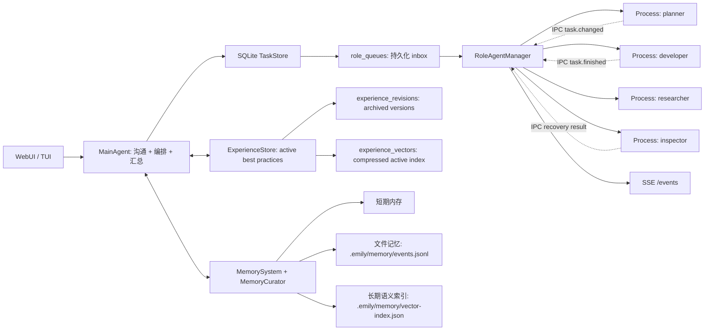

# emily-agent

一个 Node.js / TypeScript 多 agent 运行时骨架：主 agent 负责沟通、任务编排和恢复监督，subagent 作为独立进程执行具体工作。系统使用 SQLite 作为事实来源，IPC 只做实时通知；记忆系统采用原始记忆、长期索引和可更新经验三层结构。

> 当前 TypeScript 直接使用 Node 22 的原生 type stripping 运行，不引入构建链。SQLite 使用 `node:sqlite`，运行时会出现 experimental warning。

## 架构



## 已实现的 10 个可靠性优化

1. **严格 Task 状态机**
   状态流转集中在 `TaskStore.transitionTask()`，非法跳转会抛错。当前状态包括 `pending`、`queued`、`running`、`blocked`、`needs_inspection`、`done`、`failed`、`dead_letter`。

2. **lease + heartbeat**
   worker 领取任务时写入 `lease_owner`、`lease_expires_at`、`heartbeat_at`。heartbeat 会续租，main 侧 reconcile 会处理 lease 过期任务。

3. **崩溃窗口恢复**
   IPC 只发送 `taskId/eventId`。主进程收到通知后回 SQLite 查询最终状态。worker 异常退出、通知丢失、lease 过期都会进入恢复流程。

4. **持久化 role inbox**
   每个角色的任务队列存入 SQLite `role_queues` 表。主进程重启后可以继续 drain 队列，而不是依赖内存队列。

5. **结构化 `agent.md`**
   `agents/<role>/agent.md` 支持 frontmatter，定义 `role`、`singleton`、`allowed_tools`、`forbidden_tools`、`max_concurrent_tasks` 和 `capabilities`。

6. **硬权限 ToolGateway**
   subagent 不直接假定自己能用工具，必须经过 `ToolGateway.assertAllowed()`。现在先接入权限校验骨架，后续真实文件、shell、浏览器工具都应从这里走。

7. **事件订阅**
   Web adapter 提供 `GET /events` SSE。TUI/WebUI 可以订阅 `task.changed`、`task.finished`、`agent.heartbeat` 等运行事件。

8. **Memory Curator**
   `MemoryCurator` 决定哪些记录进入长期语义索引。短期内存和文件日志仍完整保留，向量层只存更有复用价值的内容。

9. **retry / dead-letter**
   task 记录 `retry_count` 和 `max_retries`。超过重试上限会进入 `dead_letter`，并记录 `deadLetterReason`。

10. **TypeScript 迁移**
    源码和测试已迁移到 `.ts`，核心类型在 `src/types.ts`。

## 经验记忆

普通 memory 是历史，experience memory 是从历史里提炼出来的可复用经验。

核心规则：

- 每天整理时最多产出或更新 3 条高质量经验。
- 同一类经验使用稳定 `topicKey`，只保留一个 `active` 当前最佳实践；如果 `topicKey` 不完全一致，会再用 scope/type、向量相似度和关键词重合做相似匹配。
- 旧版本进入 `experience_revisions`，用于审计、回滚和解释，不参与默认召回。
- 经验向量只索引 active 当前版本，避免新旧经验同时命中。
- 召回排序会考虑相似度、重要性、置信度、reuse count 和用户反馈。
- 召回流程是“先有印象，再查细节”：先命中压缩经验向量，再读取 active experience 和 evidence task。

当前经验表：

- `experiences`: 当前 active best practice。
- `experience_revisions`: 旧版本归档。
- `experience_vectors`: 压缩后的 active 经验索引。
- `experience_feedback`: 用户或主 agent 对经验的反馈，例如 `useful`、`wrong`、`outdated`、`duplicate`。

当前压缩接口在 `src/experience/VectorCompressor.ts`：

- `NoopCompressor`: 不压缩，便于调试。
- `ScalarQuantCompressor`: int8 标量量化。
- `TurboQuantPlaceholderCompressor`: 为后续 TurboQuant/PolarQuant/QJL 类算法预留同一接口。

每日经验生成入口：

```ts
runtime.buildDailyExperiences({ day: new Date() })
```

Web API：

```bash
curl -X POST http://127.0.0.1:3000/experiences/build-daily \
  -H 'content-type: application/json' \
  -d '{"day":"2026-05-03"}'

curl 'http://127.0.0.1:3000/experiences?q=sqlite%20ipc%20recovery'

curl -X POST http://127.0.0.1:3000/experiences/feedback \
  -H 'content-type: application/json' \
  -d '{"experienceId":"...","rating":"useful","comment":"命中正确"}'
```

## 运行

要求 Node.js `>=22.18`。

```bash
npm start
```

启动 Web 适配器：

```bash
npm run web
```

请求示例：

```bash
curl -X POST http://127.0.0.1:3000/chat \
  -H 'content-type: application/json' \
  -d '{"sessionId":"demo","message":"帮我设计一个 Node 多 agent 架构"}'
```

订阅事件流：

```bash
curl http://127.0.0.1:3000/events
```

## 模块边界

- `src/agents/MainAgent.ts`: 主 agent，负责用户沟通、记忆召回、角色路由、任务派发和结果汇总。
- `src/agents/SubAgent.ts`: subagent 基类，按角色定义执行具体任务并写回记忆。
- `src/tasks/TaskStore.ts`: SQLite task、agent、event、role queue、状态机、lease、retry/dead-letter。
- `src/tasks/RoleAgentManager.ts`: 每个角色最多一个独立 worker 进程，负责持久队列 drain、IPC、heartbeat、reconcile 和崩溃恢复。
- `src/workers/subagentWorker.ts`: subagent 独立进程入口，使用 `try/catch/finally` 兜底标记最终状态。
- `src/roles/RoleDefinitionLoader.ts`: 解析 `agents/<role>/agent.md` frontmatter。
- `src/tools/ToolGateway.ts`: 工具权限校验入口。
- `src/experience/ExperienceStore.ts`: active experience、版本归档和压缩索引。
- `src/experience/ExperienceBuilder.ts`: 每日经验提炼，最多保留 3 条高价值更新。
- `src/experience/ExperienceMatcher.ts`: 稳定 topicKey、相似经验匹配和合并判断。
- `src/experience/VectorCompressor.ts`: 向量压缩接口和当前 int8 实现。
- `src/storage/SchemaMigrator.ts`: SQLite schema migration 版本记录。
- `src/memory/MemorySystem.ts`: 三层记忆统一入口。
- `src/memory/MemoryCurator.ts`: 决定长期记忆写入策略。
- `src/adapters/tui.ts`: 命令行交互入口。
- `src/adapters/web.ts`: Web/API 入口，提供 `GET /health`、`GET /events`、`POST /chat`。
- `src/llm/EchoModelProvider.ts`: 本地假模型 provider，用于离线跑通架构。
- `agents/<role>/agent.md`: 角色定义，描述该类型 subagent 的工作流程、能力和限制。

## 任务与通知

SQLite 是事实来源，IPC 只负责实时通知：

1. main agent 创建 task，写入 SQLite，并生成 `.emily/tasks/task-xxx.md`。
2. `TaskStore.enqueueTask()` 把 task 写入 `role_queues`。
3. `RoleAgentManager` 每个角色最多启动一个 worker。
4. worker 领取任务后标记 `running`，写入 lease 并定期 heartbeat。
5. worker 完成后标记 `done` / `failed` / `dead_letter`，再通过 IPC 发 `task.finished`。
6. main agent 收到通知后回 SQLite 查询最终状态，不信任 IPC payload。
7. worker 异常退出或 lease 过期时，manager 把原任务转为 `needs_inspection` 并派发 `inspector`。

## 验证

```bash
npm test
npm run check
```

当前测试覆盖：

- 正常主 agent 到 subagent 的任务派发和三层记忆写入。
- worker 崩溃后 inspector 自动检查并落最终状态。
- Task 状态机、非法跳转、retry 和 dead-letter。
- 经验创建、同类经验更新、旧版本归档、active-only 召回。
- 经验相似匹配、feedback/reuse 和 schema migration 记录。

## 后续扩展

- 替换 `EchoModelProvider`，接入 OpenAI、Ollama 或其他模型服务。
- 替换 `VectorMemoryLayer`，接入 Chroma、Qdrant、Milvus、pgvector 等向量库。
- 把 `ToolGateway` 接到真实工具实现，例如文件读写、测试执行、浏览器、GitHub。
- 给 `MainAgent.selectSubAgents` 增加更精细的路由策略。
