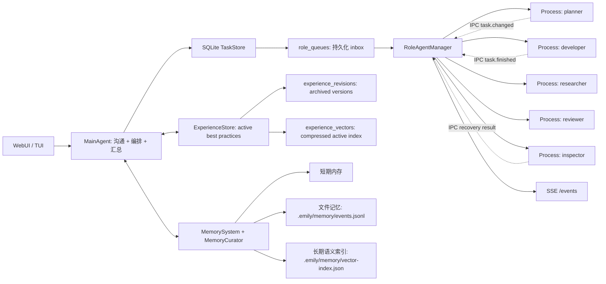

# emily-agent

一个 Node.js / TypeScript 多 agent 运行时骨架：主 agent 负责沟通、任务编排和恢复监督，subagent 作为独立进程执行具体工作。系统使用 SQLite 作为事实来源，IPC 只做实时通知；记忆系统采用原始记忆、长期索引和可更新经验三层结构。

> 当前 TypeScript 直接使用 Node 22 的原生 type stripping 运行，不引入构建链。SQLite 使用 `node:sqlite`，运行时会出现 experimental warning。

## 架构



## 已实现的 10 个可靠性优化

1. **严格 Task 状态机**
   状态流转集中在 `TaskStore.transitionTask()`，非法跳转会抛错。当前状态包括 `pending`、`queued`、`running`、`blocked`、`needs_inspection`、`done`、`failed`、`dead_letter`。

2. **lease + heartbeat**
   worker 领取任务时写入 `lease_owner`、`lease_expires_at`、`heartbeat_at`。heartbeat 会续租，main 侧 reconcile 会处理 lease 过期任务。

3. **崩溃窗口恢复**
   IPC 只发送 `taskId/eventId`。主进程收到通知后回 SQLite 查询最终状态。worker 异常退出、通知丢失、lease 过期都会进入恢复流程。

4. **持久化 role inbox**
   每个角色的任务队列存入 SQLite `role_queues` 表。主进程重启后可以继续 drain 队列，而不是依赖内存队列。

5. **结构化 `agent.md`**
   `agents/<role>/agent.md` 支持 frontmatter，定义 `role`、`singleton`、`allowed_tools`、`forbidden_tools`、`max_concurrent_tasks` 和 `capabilities`。

6. **硬权限 ToolGateway**
   subagent 不直接假定自己能用工具，必须经过 `ToolGateway.assertAllowed()`。现在先接入权限校验骨架，后续真实文件、shell、浏览器工具都应从这里走。

7. **事件订阅**
   Web adapter 提供 `GET /events` SSE。TUI/WebUI 可以订阅 `task.changed`、`task.finished`、`agent.heartbeat` 等运行事件。

8. **Memory Curator**
   `MemoryCurator` 决定哪些记录进入长期语义索引。短期内存和文件日志仍完整保留，向量层只存更有复用价值的内容。

9. **retry / dead-letter**
   task 记录 `retry_count` 和 `max_retries`。超过重试上限会进入 `dead_letter`，并记录 `deadLetterReason`。

10. **TypeScript 迁移**
    源码和测试已迁移到 `.ts`，核心类型在 `src/types.ts`。

## 运行内核

每次用户请求都会创建一个 `run`，并把 task、event、memory candidate 和最终 response 串起来，便于复盘。

已实现的核心能力：

- `runs`: 一次用户请求的结构化运行记录。
- `runs.status`: 支持 `running`、`reviewing`、`recovering`、`partially_done`、`waiting_user`、`done`、`failed`、`blocked`、`cancelled`，用于区分执行、验收、恢复、等待用户输入和主动取消。
- `TaskResult`: worker 结果使用结构化 JSON，包含 `status`、`summary`、`artifacts`、`memoryCandidates` 和 `nextActions`。
- `task_graphs`: 为一次 run 的 DAG 提供 graph id，task metadata 会带上 `graphId`，便于跨 task 追踪。
- `task_dependencies`: task graph / DAG 依赖，依赖满足后才会进入 `queued`。
- `reviewer`: 正常流程里的结果验收 agent，区别于异常恢复用的 `inspector`；reviewer 优先输出 JSON verdict，再降级解析文本，并影响 run 状态。
- `memory_candidates`: subagent 输出先成为候选记忆，统一由 `MemoryCandidatePolicy` approve / reject 后才写入 MemorySystem。
- `getTimeline({ runId })`: 返回一次 run 的 run、tasks、events。
- `getTaskTrace(taskId)`: 返回单个 task 的事件轨迹。
- `diagnostics({ repair })`: 检查 queued task、running lease、terminal queue、task graph 和 run 状态不变量，可选择修复。
- `renderTimeline(runId)`: 把结构化 timeline 渲染成人类可读 replay 文本。
- `health()`: 返回 pending/running task、过期 lease、未 ack 终态 task、待处理记忆候选和 active experience 数量。
- `maintenance()`: 执行 reconcile、刷新 task graph、收敛孤儿 run、处理遗留 memory candidates、生成每日经验，并返回维护后的健康状态。
- 状态机更新使用 `WHERE id = ? AND status = ?` 做乐观并发防护，晚到的写入会失败。
- 状态机错误分成 `IllegalTaskTransitionError` 和 `TaskTransitionConflictError`。
- runtime event payload 统一通过 `RuntimeEventFactory` 生成，避免事件结构散落在各处。
- worker 异常退出统一走 `RecoveryPolicy`，可按任务状态选择 finish、retry、dead-letter 或 inspector 复核。
- `RoleAgentManager` 会从 `role_queues` 动态发现角色，不要求所有角色预先写死在主进程。
- memory candidate 审批使用 `WHERE status = 'pending'` 条件更新，避免 main agent 和 maintenance 并发重复写入长期记忆。
- `cancelTask()` / `cancelRun()` 支持主动取消任务或整次 run，运行中的 worker 会收到 cancel 消息并被终止。

## 第二轮核心优化

这轮补齐的是主/子 agent 内核的“可运行质量”：

1. reviewer 使用结构化 JSON verdict，并保留文本 fallback。
2. 记忆候选进入 `MemoryCandidatePolicy`，避免把模板回声、短流水账写入长期记忆。
3. run 状态扩展到验收、恢复、部分完成和等待用户输入。
4. task graph 有独立 `graphId`，不再只靠 runId 和 parentTaskId 推断。
5. runtime event payload 集中在 `RuntimeEventFactory`。
6. worker 退出恢复集中在 `RecoveryPolicy`。
7. experience 增加 `applicability` 和 `contraindications`，召回时知道什么时候该用、什么时候别用。
8. memory candidate 生命周期事件统一为 created / approved / rejected。
9. runtime 暴露 `health()`，Web 端 `GET /health` 返回详细健康状态。
10. runtime 暴露 `maintenance()`，Web 端 `POST /maintenance` 可手动触发 reconcile、候选记忆审批和每日经验提炼。

## 当前健壮性加固

继续加固后的运行保障：

- `RoleAgentManager.start()` 幂等，周期性 reconcile 不会重入。
- `drainAllRoles()` 会合并默认角色、已启动角色和 SQLite 队列里的动态角色。
- `claimNextQueuedTask()` 会清理 stale queue item，先确认 task 仍可 claim，再把 queue item 标记为 running。
- IPC 发送失败会走 `RecoveryPolicy`，不会把 task 留在已领取但无人执行的状态。
- worker 晚到的 `task.finished` 不会误清当前 role 的 active task。
- `refreshTaskGraphStatuses()` 会把 graph 从 pending/running 收敛到 done/failed。
- `recoverStaleRuns()` 会把 task 已经终态但 run 仍处于 running/reviewing/recovering 的孤儿 run 收敛到最终状态。
- `health()` 现在包含 active run、queued role 和 open task graph 指标。

## 第三轮核心完善

这一轮把核心从“抗故障”补到“可控、可诊断、可维护”：

1. task/run 支持 `cancelled` 状态，并提供取消 API。
2. worker 输出统一为 `TaskResult` 结构化 JSON，主 agent/reviewer 使用 summary 视图。
3. 主 agent 常规流程通过 `TaskGraph` 创建 planner/role DAG，reviewer 也归入同一 graph。
4. task metadata 支持 `timeoutMs`、`maxResultChars` 和 `maxMemoryCandidates`，worker 会超时失败并限制结果/候选记忆数量。
5. diagnostics 检查 runtime invariant，并发出 `runtime.anomaly` 事件。
6. planner 仍是路由入口，但 role graph 已统一，为后续结构化 plan 输出留好接口。
7. experience 召回进入主 agent 前会用 `applicability/contraindications` 做二次过滤。
8. maintenance 增加 WAL checkpoint、optimize、vacuum、event retention 和 memory candidate retention。
9. Web API 增加 diagnostics、cancel-task、cancel-run 控制入口。
10. 增加 core hardening / chaos 类测试，覆盖取消、worker 超时、graph metadata、diagnostics 和 maintenance。

Web API：

```bash
curl 'http://127.0.0.1:3000/health'
curl 'http://127.0.0.1:3000/timeline?runId=...'
curl 'http://127.0.0.1:3000/timeline?runId=...&format=text'
curl 'http://127.0.0.1:3000/task-trace?taskId=...'
curl 'http://127.0.0.1:3000/diagnostics?repair=true'

curl -X POST http://127.0.0.1:3000/maintenance \
  -H 'content-type: application/json' \
  -d '{"day":"2026-05-03","staleRunMs":300000,"maxEvents":10000}'

curl -X POST http://127.0.0.1:3000/cancel-run \
  -H 'content-type: application/json' \
  -d '{"runId":"...","reason":"用户取消"}'
```

## 经验记忆

普通 memory 是历史，experience memory 是从历史里提炼出来的可复用经验。

核心规则：

- 每天整理时最多产出或更新 3 条高质量经验。
- 同一类经验使用稳定 `topicKey`，只保留一个 `active` 当前最佳实践；如果 `topicKey` 不完全一致，会再用 scope/type、向量相似度和关键词重合做相似匹配。
- 旧版本进入 `experience_revisions`，用于审计、回滚和解释，不参与默认召回。
- 经验向量只索引 active 当前版本，避免新旧经验同时命中。
- 召回排序会考虑相似度、重要性、置信度、reuse count 和用户反馈。
- 每条经验记录适用条件 `applicability` 和禁用条件 `contraindications`，避免相似但场景不同的经验被误用。
- `conflict` / `split` 更新会创建新的 active topic，`deprecated` 会归档旧版本并从默认召回移除。
- 召回流程是“先有印象，再查细节”：先命中压缩经验向量，再读取 active experience 和 evidence task。

当前经验表：

- `experiences`: 当前 active best practice。
- `experience_revisions`: 旧版本归档。
- `experience_vectors`: 压缩后的 active 经验索引。
- `experience_feedback`: 用户或主 agent 对经验的反馈，例如 `useful`、`wrong`、`outdated`、`duplicate`。

当前压缩接口在 `src/experience/VectorCompressor.ts`：

- `NoopCompressor`: 不压缩，便于调试。
- `ScalarQuantCompressor`: int8 标量量化。
- `TurboQuantPlaceholderCompressor`: 为后续 TurboQuant/PolarQuant/QJL 类算法预留同一接口。

每日经验生成入口：

```ts
runtime.buildDailyExperiences({ day: new Date() })
```

Web API：

```bash
curl -X POST http://127.0.0.1:3000/experiences/build-daily \
  -H 'content-type: application/json' \
  -d '{"day":"2026-05-03"}'

curl 'http://127.0.0.1:3000/experiences?q=sqlite%20ipc%20recovery'

curl -X POST http://127.0.0.1:3000/experiences/feedback \
  -H 'content-type: application/json' \
  -d '{"experienceId":"...","rating":"useful","comment":"命中正确"}'
```

## 运行

要求 Node.js `>=22.18`。

```bash
npm start
```

启动 Web 适配器：

```bash
npm run web
```

请求示例：

```bash
curl -X POST http://127.0.0.1:3000/chat \
  -H 'content-type: application/json' \
  -d '{"sessionId":"demo","message":"帮我设计一个 Node 多 agent 架构"}'
```

订阅事件流：

```bash
curl http://127.0.0.1:3000/events
```

## 模块边界

- `src/agents/MainAgent.ts`: 主 agent，负责用户沟通、记忆召回、角色路由、任务派发和结果汇总。
- `src/agents/SubAgent.ts`: subagent 基类，按角色定义执行具体任务并写回记忆。
- `src/tasks/TaskStore.ts`: SQLite task、agent、event、role queue、状态机、lease、retry/dead-letter。
- `src/tasks/TaskGraph.ts`: 将 task graph spec 落成 tasks + dependencies。
- `src/tasks/TaskResult.ts`: 结构化 task result 序列化、解析和 summary 提取。
- `src/tasks/errors.ts`: 状态机错误类型。
- `src/events/RuntimeEventFactory.ts`: 统一生成 runtime event payload。
- `src/recovery/RecoveryPolicy.ts`: worker exit / 异常恢复决策。
- `src/review/ReviewerVerdict.ts`: reviewer 结构化 verdict parser。
- `src/timeline/renderTimeline.ts`: timeline 文本 replay 渲染。
- `src/tasks/RoleAgentManager.ts`: 每个角色最多一个独立 worker 进程，负责持久队列 drain、IPC、heartbeat、reconcile 和崩溃恢复。
- `src/workers/subagentWorker.ts`: subagent 独立进程入口，使用 `try/catch/finally` 兜底标记最终状态。
- `src/roles/RoleDefinitionLoader.ts`: 解析 `agents/<role>/agent.md` frontmatter。
- `src/tools/ToolGateway.ts`: 工具权限校验入口。
- `src/experience/ExperienceStore.ts`: active experience、版本归档和压缩索引。
- `src/experience/ExperienceBuilder.ts`: 每日经验提炼，最多保留 3 条高价值更新。
- `src/experience/ExperienceMatcher.ts`: 稳定 topicKey、相似经验匹配和合并判断。
- `src/experience/VectorCompressor.ts`: 向量压缩接口和当前 int8 实现。
- `src/storage/SchemaMigrator.ts`: SQLite schema migration 版本记录。
- `src/memory/MemorySystem.ts`: 三层记忆统一入口。
- `src/memory/MemoryCurator.ts`: 决定长期记忆写入策略。
- `src/memory/MemoryCandidatePolicy.ts`: 决定候选记忆是否进入长期记忆。
- `src/adapters/tui.ts`: 命令行交互入口。
- `src/adapters/web.ts`: Web/API 入口，提供 `GET /health`、`GET /events`、`POST /chat`。
- `src/llm/EchoModelProvider.ts`: 本地假模型 provider，用于离线跑通架构。
- `agents/<role>/agent.md`: 角色定义，描述该类型 subagent 的工作流程、能力和限制。

## 任务与通知

SQLite 是事实来源，IPC 只负责实时通知：

1. main agent 创建 task，写入 SQLite，并生成 `.emily/tasks/task-xxx.md`。
2. `task_dependencies` 表描述 task graph，依赖未满足时 task 会保持等待。
3. `TaskStore.enqueueTask()` 把可运行 task 写入 `role_queues`。
4. `RoleAgentManager` 每个角色最多启动一个 worker。
5. worker 领取任务后标记 `running`，写入 lease 并定期 heartbeat。
6. worker 完成后写入结构化 `TaskResult`，标记 `done` / `failed` / `cancelled` / `dead_letter`，再通过 IPC 发 `task.finished`。
7. main agent 收到通知后回 SQLite 查询最终状态，不信任 IPC payload。
8. worker 异常退出或 lease 过期时，manager 先走 `RecoveryPolicy`；能确认已有结果则 finish，可重试则 retry，超过上限则 dead-letter，否则转为 `needs_inspection` 并派发 `inspector`。

## 验证

```bash
npm test
npm run check
```

当前测试覆盖：

- 正常主 agent 到 subagent 的任务派发和三层记忆写入。
- worker 崩溃后 inspector 自动检查并落最终状态。
- runtime 重启后继续 drain 已持久化 queued task，包括动态角色。
- Task 状态机、非法跳转、retry 和 dead-letter。
- task/run 取消、worker 超时、结构化 TaskResult。
- run/timeline、reviewer flow、memory candidates。
- reviewer verdict parser、memory candidate policy、候选记忆并发审批、runtime health/maintenance。
- task graph 状态刷新和孤儿 run 收敛。
- diagnostics invariant 和 database retention maintenance。
- 经验创建、同类经验更新、旧版本归档、active-only 召回。
- 经验相似匹配、applicability/contraindications、feedback/reuse 和 schema migration 记录。

## 后续扩展

- 替换 `EchoModelProvider`，接入 OpenAI、Ollama 或其他模型服务。
- 替换 `VectorMemoryLayer`，接入 Chroma、Qdrant、Milvus、pgvector 等向量库。
- 把 `ToolGateway` 接到真实工具实现，例如文件读写、测试执行、浏览器、GitHub。
- 给 `MainAgent.selectSubAgents` 增加更精细的路由策略。
